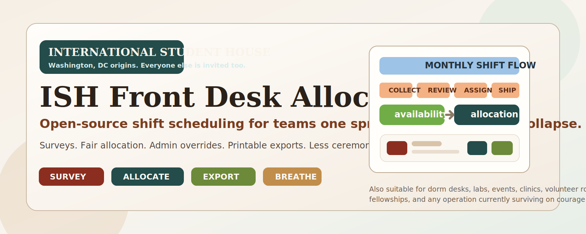

<div align="center">
  
</div>

<h1 align="center">ISH Front Desk Allocator</h1>

<p align="center">
  <strong>Open-source shift allocation software for organizations that would prefer not to manage staffing through panic, spreadsheets, and increasingly aggressive group chats.</strong>
</p>

<p align="center">
  Built for <strong>International Student House, Washington DC</strong>. Released for everyone else because shift chaos, sadly, is not unique.
</p>

<p align="center">
  
  
  
</p>

## What This Is

`ISH Front Desk Allocator` is a scheduling framework for any place where people:

1. submit availability,
2. expect fair shift assignments,
3. absolutely do not want to be assigned something they never volunteered for, and
4. become spiritually unwell when the final schedule is unreadable.

It began life as a practical system for the Front Desk at International Student House, Washington DC. It is now general enough to be forked and adapted for almost any recurring shift-based workflow where fairness, visibility, and administrative sanity matter.

In plainer English: if your current process involves one spreadsheet, three side lists, four contradictory WhatsApp replies, and one heroic coordinator pretending everything is fine, this project is for you.

## Why It Exists

Because "we can just do it manually" has destroyed more evenings than bad Wi-Fi.

Most shift systems fail in one of five extremely dignified ways:

- nobody knows who is actually available,
- the final allocation is visibly unfair,
- AFP or capped categories get mixed in with everyone else and wreck the stats,
- admins cannot make manual adjustments without breaking the whole schedule,
- the exported calendar looks like it was printed during a power outage.

This project exists to make those problems somebody else's childhood memory.

## What It Does

- Generates month-based availability surveys with weekday and weekend slots.
- Collects responses and stores respondent information consistently across surveys.
- Lets admins review, edit, add, and remove selected shifts before allocation.
- Supports inclusion/exclusion of respondents for a given run.
- Supports AFP caps, penalties, and manual overrides.
- Runs allocations with fairness constraints instead of pure vibes.
- Surfaces availability analytics and respondent history.
- Exports the final schedule as printable image and PDF outputs.
- Keeps admin actions behind login while allowing public survey links for respondents.

## A Very Normal Workflow

1. Create a survey for a month.
2. Send the link to respondents.
3. Watch people remember that deadlines are real only in the final 47 minutes.
4. Close the survey.
5. Review responses, clean up edge cases, set AFP caps, add penalties if needed.
6. Run allocation.
7. Adjust any final assignments manually.
8. Export a schedule that does not look embarrassed to exist.

## Places This Framework Can Be Used

This was built for a front desk. It is absolutely not limited to a front desk.

### Obvious Uses

- residence hall front desks
- apartment concierge or reception teams
- hostel or student housing duty desks
- embassy or fellowship duty staffing
- lab monitors and equipment desk staff
- student center or library circulation desks
- admissions event staffing
- volunteer welcome desks
- museum or gallery floor staffing
- conference registration crews

### Slightly More Chaotic Uses

- call center or hotline rotations
- maker space supervisors
- study room proctors
- tutoring desk coverage
- hackathon help desk staffing
- community kitchen volunteer shifts
- co-working space hosts
- club event crew assignments
- film festival usher schedules
- podcast studio monitors

### Uses For Teams Who Are Already In Too Deep

- church or community center ushers
- legal clinic student volunteers
- health outreach tabling shifts
- student newspaper production nights
- rehearsal room supervision
- campus orientation staffing
- academic conference moderators
- makers market booth rosters
- after-school program supervision
- any duty rota currently described as "we have a Google Sheet somewhere"

<details>
<summary><strong>Short rule of thumb</strong></summary>

If humans pick availability, another human needs to allocate time fairly, and someone will complain if the final schedule looks ugly, this framework is probably a fit.

</details>

## Why Not Just Use A Spreadsheet?

You can. People do lots of things they technically can do.

Spreadsheets are fine until you need all of the following at once:

- recurring month creation,
- structured shift choices,
- consistent respondent identity,
- historical analytics,
- fair allocation logic,
- category-based caps,
- penalties,
- manual admin adjustments,
- externally shareable surveys,
- clean exports for printing.

At that point the spreadsheet stops being a tool and becomes folklore.

## What Makes This Useful

### For Admins

- You can generate surveys quickly instead of recreating the month by hand.
- You can inspect who chose what before allocation.
- You can include or exclude respondents for a run.
- You can edit selected shifts before generating the final schedule.
- You can manually adjust allocations afterward without detonating the rest of the month.
- You can export something printable without apologizing first.

### For Respondents

- They see a clean public survey.
- They select only the shifts they are actually available for.
- Their recurring identity details can stay consistent across surveys.
- They are not supposed to get assigned random shifts they never picked, which is a surprisingly premium feature in some systems.

### For Organizations

- It creates an audit trail.
- It reduces coordinator dependence on memory.
- It helps preserve fairness over time.
- It makes the process repeatable enough that leadership transitions do not resemble a controlled demolition.

## Architecture, In Human Language

This repo is a workspace-based TypeScript project with:

- a public/admin frontend in React + Vite,
- an API server in Express,
- shared API contracts and Zod types,
- a database layer for surveys, respondents, responses, shifts, and allocations,
- export logic for printable schedule files.

You do not need to love monorepos to use it. You only need to tolerate them briefly.

## Quick Start

```bash
pnpm install
pnpm build
pnpm run smoke:deploy-local
```

For local development, the project is organized as a workspace with a frontend app and API server under `artifacts/`.

## Local URLs

- Admin login: `http://localhost:3000/admin/login`
- Public survey form: `http://localhost:3000/respond/<token>`

## Deployment Options

See these docs for the grown-up version:

- [DEPLOYMENT.md](DEPLOYMENT.md)
- [ZERO_COST_SELF_HOSTING.md](ZERO_COST_SELF_HOSTING.md)

If you want:

- a quick managed deployment: use a hosted app platform,
- a no-cost long-term setup: self-host with Docker, Caddy, and Duck DNS,
- a temporary demo link: run locally and tunnel it,
- a permanent branded URL: buy a domain like a responsible adult.

## Good Fits

This project is especially good for teams that care about:

- fairness,
- repeatability,
- readable printable schedules,
- historical respondent tracking,
- not rebuilding the same scheduling process every month from scratch.

## Bad Fits

This project is probably overkill if:

- you schedule three people twice a year,
- your team genuinely enjoys manually editing spreadsheets,
- nobody cares who got what hours,
- the phrase "we will simply decide it in the room" has never once gone wrong for you.

## Forking And Customization

Fork it. Rename it. Theme it. Swap the terminology. Change the shift logic. Replace "front desk" with "volunteer host," "desk assistant," "gallery monitor," "resident aide," or whatever your operation calls the people bravely holding it together.

This repo was built for one real operational context, but the framework is intentionally open enough to be repurposed for many others.

## Copyright, License, And The Gentle Legal Bit

Copyright (c) 2026 Ziauddin Sherkar.

Licensed under the [MIT License](LICENSE).

That means you can use, modify, distribute, and adapt this software freely, including for your own organization or fork.

## Liability Waiver

This software is provided **"as is"**, without warranties or guarantees of any kind. By using this repository, you agree that the author and contributors are not liable for claims, damages, data loss, scheduling errors, missed shifts, broken expectations, admin panic, deadline amnesia, or other consequences resulting from use or misuse of this software.

To put it less legally and more honestly: use it freely, customize it shamelessly, and please sanity-check the schedule before sending it to 40 people.

## Contributing

Improvements are welcome.

Especially welcome:

- bug fixes,
- scheduling logic improvements,
- better exports,
- deployment polish,
- documentation that saves future admins from despair.

If this project saves your team from one cursed rota spreadsheet, it has already done meaningful public service.
